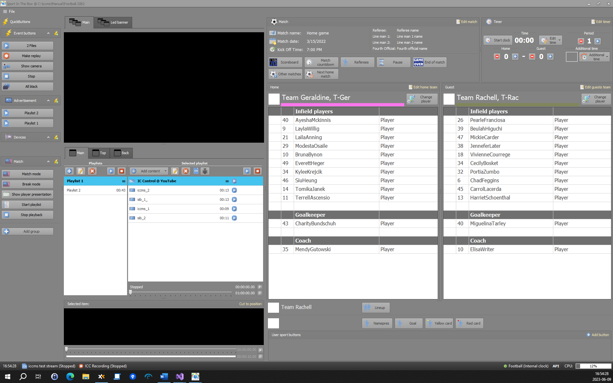

# companion-module-iccms-sib

Sport In The Box 2 Companion plugin.

## Table of Contents

- [Description](#description)
- [Installation](#installation)
- [Usage](#usage)
- [Development](#development)

## Description

SportInTheBoxVersion In The Box is a powerful production and playout system that allows the user to create engaging live content and output it to videoboards, in-house tv systems and streaming.

For more information and contacts visit [our website](https://www.iccmediasport.com/en/sport-in-the-box/)

## Installation

[Download and install Companion v3+](https://bitfocus.io/companion)

Installation and usage videos:

[Getting Started with Companion | E43](https://www.youtube.com/watch?v=jjbxzVrAG4M)

Inspiration

[Running Stream Deck + Companion SIMULTANEOUSLY to control your ATEM Mini Extreme & Pro!](https://www.youtube.com/watch?v=6MMEMYi6LuU)

[Bitfocus Companion + Streamdeck + vMix | One Man's Stream EP66 | Bitfocus Companion Tutorial ](https://www.youtube.com/watch?v=TWPwCm49ej4)

[Getting Started with Companion | E43](https://www.youtube.com/watch?v=jjbxzVrAG4M)

[Working with Companion Variables – DJF Ep33](https://www.youtube.com/watch?v=ONDNFpv-uCM)

## Features

* Fire QuickButton from StreamDeck.
* Open and change SIB database.
* Change team.

## Usage

Plugin uses SIB api to fire QuickButton events via *Trigger ID*.

API password is set in *Settings -> General -> API*

## Development

Package manager is Yarn V3 with linker as 'node_modules', [Yarn 3 nodeLinker: node-modules](https://stackoverflow.com/questions/71063201/yarn-3-nodelinker-node-modules)

[Module development home](https://github.com/bitfocus/companion-module-base/wiki)

[Module packaging](https://github.com/bitfocus/companion-module-base/wiki/Module-packaging)

See scripts section in packages.json.

## Node troubleshooting

If `yarn` is not found run `npm install -g yarn` in Node.js command prompt.

If getting error

> companion-module/base@1.2.1: The engine "node" is incompatible with this module. Expected version "^18.12". Got "20.0.0"

run

`$yarn install --ignore-engines`

## Node version

Download [NVM for Windows](https://github.com/coreybutler/nvm-windows)

[How to switch node version](https://blog.logrocket.com/switching-between-node-versions-during-development/)

Once installation is complete, open a command window and confirm nvm is available:

`D:\>nvm version`

    1.1.10

Companion uses 18.12 only. Check current version with

    > nvm list
        *  20.0.0 (Currently using 64-bit executable)
        18.12.1

Install 18.12

`nvm install 18.12`

Check that it was installed and use it.
`nvm list`
`nvm use 18.12`

    > nvm list
        20.0.0
        * 18.12.1 (Currently using 64-bit executable)

## Restore packages

`yarn`

If yarn throws err

    > Error: Cannot find module 'C:\Users\dmitr\Documents\Repos\companion-module-dev\companion-module-test_company-test_websocket\.yarn\releases\yarn-1.22.19.cjs'

run

`npm install --global yarn`

[NVM for Windows](https://github.com/yarnpkg/berry/issues/1733)

    > Finally, note that if you check-in the binaries as we suggest, the semantic way to "reset" your .yarn folder is:

`rm -rf .yarn && git checkout .yarn && yarn`

## PowerShell

    The file C:\Users\dmitr\AppData\Roaming\npm\yarn.ps1 is not digitally signed.

This is a powershell security policy, to fix it, run Powershell as administrator and run the following

    `PS C:\> Set-ExecutionPolicy RemoteSigned`

If you don't want to run the command as an administrator but just for the current user, you can add a scope like below

    `PS C:\> Set-ExecutionPolicy RemoteSigned -Scope CurrentUser`

The stricter the policy, the more secure your system becomes.

You can change _RemoteSigned_ to other options like: Restricted, AllSigned, RemoteSigned, Unrestricted

## Packaging

### SSH
May need to add public SSH key to GitHub account.

[Git: How to solve Permission denied (publickey) error when using Git?](https://stackoverflow.com/questions/2643502/git-how-to-solve-permission-denied-publickey-error-when-using-git/63023541#63023541)

[Error: Permission denied (publickey)](https://docs.github.com/en/authentication/troubleshooting-ssh/error-permission-denied-publickey)

Works better when running scripts in bash.

### Globals

May need to run

`npm install --global webpack`
`npm link webpack`
`npm install --global husky`

## How to Contribute

Mail us :)

## Tests

Package manage is yarn.
`yarn test`
